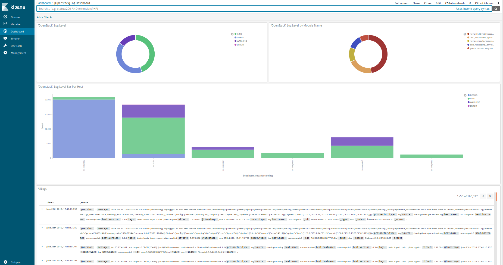

Install ELK with beats to gather metrics
########################################
:tags: openstack, ansible

..
About this repository
---------------------

This set of playbooks will deploy an elastic stack cluster (Elasticsearch,
Logstash, Kibana) with beats to gather metrics from hosts and store them into
the elastic stack.

**These playbooks require Ansible 2.5+.**

Highlevel overview of the Elastic Stack infrastructure these playbooks will
build and operate against.

.. image:: assets/Elastic-Stack-Diagram.svg
    :scale: 50 %
    :alt: Elasticsearch Architecture Diagram
    :align: center

OpenStack-Ansible Integration
-----------------------------

These playbooks can be used as standalone inventory or as an integrated part of
an OpenStack-Ansible deployment. For a simple example of standalone inventory,
see [test-inventory.yml](tests/inventory/test-inventory.yml).

Optional | Load balancer configuration
^^^^^^^^^^^^^^^^^^^^^^^^^^^^^^^^^^^^^^

Configure the Elasticsearch endpoints:
  While the Elastic stack cluster does not need a load balancer to scale, it is
  useful when accessing the Elasticsearch cluster using external tooling. Tools
  like OSProfiler, Grafana, etc will all benefit from being able to interact
  with Elasticsearch using the load balancer. This provides better fault
  tolerance especially when compared to connecting to a single node.
  The following section can be added to the `haproxy_extra_services` list to
  create an Elasticsearch backend. The ingress port used to connect to
  Elasticsearch is **9201**. The backend port is **9200**. If this backend is
  setup make sure you set the `internal_lb_vip_address` on the CLI or within a
  known variable file which will be sourced at runtime. If using HAProxy, edit
  the `/etc/openstack_deploy/user_variables.yml` file and add the following
  lines.

.. code-block:: yaml

    haproxy_extra_services:
      - service:
          haproxy_service_name: elastic-logstash
          haproxy_ssl: False
          haproxy_backend_nodes: "{{ groups['Kibana'] | default([]) }}"  # Kibana nodes are also Elasticsearch coordination nodes
          haproxy_port: 9201  # This is set using the "elastic_hap_port" variable
          haproxy_check_port: 9200  # This is set using the "elastic_port" variable
          haproxy_backend_port: 9200  # This is set using the "elastic_port" variable
          haproxy_balance_type: tcp

Configure the Kibana endpoints:
  It is recommended to use a load balancer with Kibana. Like Elasticsearch, a
  load balancer is not required however without one users will need to directly
  connect to a single Kibana node to access the dashboard. If a load balancer is
  present it can provide a highly available address for users to access a pool
  of Kibana nodes which will provide a much better user experience. If using
  HAProxy, edit the `/etc/openstack_deploy/user_variables.yml` file and add the
  following lines.

.. code-block:: yaml

    haproxy_extra_services:
      - service:
          haproxy_service_name: Kibana
          haproxy_ssl: False
          haproxy_backend_nodes: "{{ groups['Kibana'] | default([]) }}"
          haproxy_port: 81  # This is set using the "Kibana_nginx_port" variable
          haproxy_balance_type: tcp

Configure the APM endpoints:
  It is recommented to use a load balancer for submitting Application
  Performance Monitoring data to the APM server. A load balancer will provide
  a highly available address which APM clients can use to connect to a pool of
  APM nodes. If using HAProxy, edit the `/etc/openstack_deploy/user_variables.yml`
  and add the following lines

.. code-block:: yaml

    haproxy_extra_services:
      - service:
          haproxy_service_name: apm-server
          haproxy_ssl: False
          haproxy_backend_nodes: "{{ groups['apm-server'] | default([]) }}"
          haproxy_port: 8200 # this is set using the "apm_port" variable
          haproxy_balance_type: tcp

Optional | add OSProfiler to an OpenStack-Ansible deployment
^^^^^^^^^^^^^^^^^^^^^^^^^^^^^^^^^^^^^^^^^^^^^^^^^^^^^^^^^^^^

To initialize the `OSProfiler` module within openstack the following overrides
can be applied to a user variables file. The hmac key needs to be defined
consistently throughout the environment.

Full example to initialize the `OSProfiler` modules throughout an
OpenStack-Ansible deployment.

.. code-block:: yaml

    profiler_overrides: &os_profiler
      profiler:
        enabled: true
        trace_sqlalchemy: true
        hmac_keys: "UNIQUE_HMACKEY"  # This needs to be set consistently throughout the deployment
        connection_string: "Elasticsearch://{{ internal_lb_vip_address }}:9201"
        es_doc_type: "notification"
        es_scroll_time: "2m"
        es_scroll_size: "10000"
        filter_error_trace: "false"

    aodh_aodh_conf_overrides: *os_profiler
    barbican_config_overrides: *os_profiler
    ceilometer_ceilometer_conf_overrides: *os_profiler
    cinder_cinder_conf_overrides: *os_profiler
    designate_designate_conf_overrides: *os_profiler
    glance_glance_api_conf_overrides: *os_profiler
    gnocchi_conf_overrides: *os_profiler
    heat_heat_conf_overrides: *os_profiler
    horizon_config_overrides: *os_profiler
    ironic_ironic_conf_overrides: *os_profiler
    keystone_keystone_conf_overrides: *os_profiler
    magnum_config_overrides: *os_profiler
    neutron_neutron_conf_overrides: *os_profiler
    nova_nova_conf_overrides: *os_profiler
    octavia_octavia_conf_overrides: *os_profiler
    rally_config_overrides: *os_profiler
    sahara_conf_overrides: *os_profiler
    swift_swift_conf_overrides: *os_profiler
    tacker_tacker_conf_overrides: *os_profiler
    trove_config_overrides: *os_profiler

If a deployer wishes to use multiple keys they can do so by specifying a comma separated
list.

.. code-block:: yaml

    profiler_overrides: &os_profiler
      profiler:
        hmac_keys: "key1,key2"

To add the `OSProfiler` section to an exist set of overrides, the `yaml` section
can be added or dynamically appended to a given hash using `yaml` tags.

.. code-block:: yaml

    profiler_overrides: &os_profiler
      profiler:
        enabled: true
        hmac_keys: "UNIQUE_HMACKEY"  # This needs to be set consistently throughout the deployment
        connection_string: "Elasticsearch://{{ internal_lb_vip_address }}:9201"
        es_doc_type: "notification"
        es_scroll_time: "2m"
        es_scroll_size: "10000"
        filter_error_trace: "false"

    # Example to merge the os_profiler tag to into an existing override hash
    nova_nova_conf_overrides:
      section1_override:
        key: "value"
      <<: *os_profiler

While the `osprofiler` and `Elasticsearch` libraries should be installed
within all virtual environments by default, it's possible they're missing
within a given deployment. To install these dependencies throughout the
cluster without having to invoke a *repo-build* run the following *adhoc*
Ansible command.

  The version of the Elasticsearch python library should match the major version of
  of Elasticsearch being deployed within the environment.

.. code-block:: bash

    ansible -m shell -a 'find /openstack/venvs/* -maxdepth 0 -type d -exec {}/bin/pip install osprofiler "elasticsearch>=6.0.0,<7.0.0" --isolated \;' all

Once the overrides are in-place the **openstack-ansible** playbooks will need to
be rerun. To simply inject these options into the system a deployer will be able
to use the `*-config` tags that are apart of all `os_*` roles. The following
example will run the **config** tag on **ALL** openstack playbooks.

.. code-block:: bash

    openstack-ansible setup-openstack.yml --tags "$(cat setup-openstack.yml | grep -wo 'os-.*' | awk -F'-' '{print $2 "-config"}' | tr '\n' ',')"

Once the `OSProfiler` module has been initialized tasks can be profiled on
demand by using the `--profile` or `--os-profile` switch in the various
openstack clients along with one of the given hmac keys defined.

Legacy profile example command.

.. code-block:: bash

    glance --profile key1 image-list

Modern profile example command, requires `python-openstackclient >= 3.4.1` and
the `osprofiler` library.

.. code-block:: bash

    openstack --os-profile key2 image list

If the client library is not installed in the same path as the
`python-openstackclient` client, run the following command to install the
required library.

.. code-block:: bash

    pip install osprofiler

Optional | run the haproxy-install playbook
^^^^^^^^^^^^^^^^^^^^^^^^^^^^^^^^^^^^^^^^^^^

.. code-block:: bash

    cd /opt/openstack-ansible/playbooks/
    openstack-ansible haproxy-install.yml --tags=haproxy-service-config

Setup | system configuration
^^^^^^^^^^^^^^^^^^^^^^^^^^^^

Clone the elk-osa repo

.. code-block:: bash

    cd /opt
    git clone https://github.com/openstack/openstack-ansible-ops

Copy the env.d file into place

.. code-block:: bash

    cd /opt/openstack-ansible-ops/elk_metrics_6x
    cp env.d/elk.yml /etc/openstack_deploy/env.d/

Copy the conf.d file into place

.. code-block:: bash

    cp conf.d/elk.yml /etc/openstack_deploy/conf.d/

In **elk.yml**, list your logging hosts under elastic-logstash_hosts to create
the Elasticsearch cluster in multiple containers and one logging host under
`kibana_hosts` to create the Kibana container

.. code-block:: bash

    vi /etc/openstack_deploy/conf.d/elk.yml

Create the containers

.. code-block:: bash

   cd /opt/openstack-ansible/playbooks
   openstack-ansible lxc-containers-create.yml --limit elk_all

Deploying | Installing with embedded Ansible
^^^^^^^^^^^^^^^^^^^^^^^^^^^^^^^^^^^^^^^^^^^^

If this is being executed on a system that already has Ansible installed but is
incompatible with these playbooks the script `bootstrap-embedded-ansible.sh` can
be sourced to grab an embedded version of Ansible prior to executing the
playbooks.

.. code-block:: bash

    source bootstrap-embedded-ansible.sh

Deploying | Manually resolving the dependencies
^^^^^^^^^^^^^^^^^^^^^^^^^^^^^^^^^^^^^^^^^^^^^^^

This playbook has external role dependencies. If Ansible is not installed with
the `bootstrap-ansible.sh` script these dependencies can be resolved with the
``ansible-galaxy`` command and the ``ansible-role-requirements.yml`` file.

* Example galaxy execution

.. code-block:: bash

    ansible-galaxy install -r ansible-role-requirements.yml

Once the dependencies are set make sure to set the action plugin path to the
location of the config_template action directory. This can be done using the
environment variable `ANSIBLE_ACTION_PLUGINS` or through the use of an
`ansible.cfg` file.

Deploying | The environment
^^^^^^^^^^^^^^^^^^^^^^^^^^^

Install master/data Elasticsearch nodes on the elastic-logstash containers,
deploy Logstash, deploy Kibana, and then deploy all of the service beats.

.. code-block:: bash

    cd /opt/openstack-ansible-ops/elk_metrics_6x
    ansible-playbook site.yml $USER_VARS

* The `openstack-ansible` command can be used if the version of ansible on the
  system is greater than **2.5**. This will automatically pick up the necessary
  group_vars for hosts in an OSA deployment.

* If required add ``-e@/opt/openstack-ansible/inventory/group_vars/all/all.yml``
  to import sufficient OSA group variables to define the OpenStack release.
  Journalbeat will then deploy onto all hosts/containers for releases prior to
  Rocky, and hosts only for Rocky onwards. If the variable ``openstack_release``
  is undefined the default behaviour is to deploy Journalbeat to hosts only.

* Alternatively if using the embedded ansible, create a symlink to include all
  of the OSA group_vars. These are not available by default with the embedded
  ansible and can be symlinked into the ops repo.

.. code-block:: bash

    ln -s /opt/openstack-ansible/inventory/group_vars /opt/openstack-ansible-ops/elk_metrics_6x/group_vars

The individual playbooks found within this repository can be independently run
at anytime.

Architecture | Data flow
^^^^^^^^^^^^^^^^^^^^^^^^

This diagram outlines the data flow from within an Elastic Stack deployment.

.. image:: assets/Elastic-dataflow.svg
    :scale: 50 %
    :alt: Elastic Stack Data Flow Diagram
    :align: center

Optional | Enable uwsgi stats
^^^^^^^^^^^^^^^^^^^^^^^^^^^^^

Config overrides can be used to make uwsgi stats available on unix
domain sockets. Any /tmp/*uwsgi-stats.sock will be picked up by Metricsbeat.

.. code-block:: yaml

    keystone_uwsgi_ini_overrides:
      uwsgi:
        stats: "/tmp/keystone-uwsgi-stats.sock"

    cinder_api_uwsgi_ini_overrides:
      uwsgi:
        stats: "/tmp/cinder-api-uwsgi-stats.sock"

    glance_api_uwsgi_ini_overrides:
      uwsgi:
        stats: "/tmp/glance-api-uwsgi-stats.sock"

    heat_api_uwsgi_ini_overrides:
      uwsgi:
        stats: "/tmp/heat-api-uwsgi-stats.sock"

    heat_api_cfn_init_overrides:
      uwsgi:
        stats: "/tmp/heat-api-cfn-uwsgi-stats.sock"

    nova_api_metadata_uwsgi_ini_overrides:
      uwsgi:
        stats: "/tmp/nova-api-metadata-uwsgi-stats.sock"

    nova_api_os_compute_uwsgi_ini_overrides:
      uwsgi:
        stats: "/tmp/nova-api-os-compute-uwsgi-stats.sock"

    nova_placement_uwsgi_ini_overrides:
      uwsgi:
        stats: "/tmp/nova-placement-uwsgi-stats.sock"

    octavia_api_uwsgi_ini_overrides:
      uwsgi:
        stats: "/tmp/octavia-api-uwsgi-stats.sock"

    sahara_api_uwsgi_ini_overrides:
      uwsgi:
        stats: "/tmp/sahara-api-uwsgi-stats.sock"

    ironic_api_uwsgi_ini_overrides:
      uwsgi:
        stats: "/tmp/ironic-api-uwsgi-stats.sock"

    magnum_api_uwsgi_ini_overrides:
      uwsgi:
        stats: "/tmp/magnum-api-uwsgi-stats.sock"

Rerun all of the **openstack-ansible** playbooks to enable these stats. Use
the `${service_name}-config` tags on all of the `os_*` roles. It's possible to
auto-generate the tags list with the following command.

.. code-block:: bash

    openstack-ansible setup-openstack.yml --tags "$(cat setup-openstack.yml | grep -wo 'os-.*' | awk -F'-' '{print $2 "-config"}' | tr '\n' ',')"

Optional | add Kafka Output format
^^^^^^^^^^^^^^^^^^^^^^^^^^^^^^^^^^

To send data from Logstash to Kafka create the `logstash_kafka_options`
variable. This variable will be used as a generator and create a Kafka output
configuration file using the key/value pairs as options.

.. code-block:: yaml

    logstash_kafka_options:
      codec: json
      topic_id: "elk_kafka"
      ssl_key_password: "{{ logstash_kafka_ssl_key_password }}"
      ssl_keystore_password: "{{ logstash_kafka_ssl_keystore_password }}"
      ssl_keystore_location: "/var/lib/logstash/{{ logstash_kafka_ssl_keystore_location | basename }}"
      ssl_truststore_location: "/var/lib/logstash/{{ logstash_kafka_ssl_truststore_location | basename }}"
      ssl_truststore_password: "{{ logstash_kafka_ssl_truststore_password }}"
      bootstrap_servers:
        - server1.local:9092
        - server2.local:9092
        - server3.local:9092
      client_id: "elk_metrics_6x"
      compression_type: "gzip"
      security_protocol: "SSL"
      id: "UniqueOutputID"

For a complete list of all options available within the Logstash Kafka output
plugin please review the `following documentation <https://www.elastic.co/guide/en/logstash/current/plugins-outputs-kafka.html>`_.

Optional config:
  The following variables are optional and correspond to the example
  `logstash_kafka_options` variable.

.. code-block:: yaml

    logstash_kafka_ssl_key_password: "secrete"
    logstash_kafka_ssl_keystore_password: "secrete"
    logstash_kafka_ssl_truststore_password: "secrete"

    # SSL certificates in Java KeyStore format
    logstash_kafka_ssl_keystore_location: "/root/kafka/keystore.jks"
    logstash_kafka_ssl_truststore_location: "/root/kafka/truststore.jks"

When using the kafka output plugin the options,
`logstash_kafka_ssl_keystore_location` and
`logstash_kafka_ssl_truststore_location` will automatically copy a local SSL key
to the logstash nodes. These options are string value and assume the deployment
nodes have local access to the files.

Optional | add Grafana visualizations
^^^^^^^^^^^^^^^^^^^^^^^^^^^^^^^^^^^^^

See the grafana directory for more information on how to deploy grafana.
When deploying grafana, source the variable file from ELK in order to
automatically connect grafana to the Elasticsearch datastore and import
dashboards. Including the variable file is as simple as adding
``-e @../elk_metrics_6x/vars/variables.yml`` to the grafana playbook
run.

Included dashboards.

* https://grafana.com/dashboards/5569
* https://grafana.com/dashboards/5566

Example command using the embedded Ansible from within the grafana directory.

.. code-block:: bash

    ansible-playbook ${USER_VARS} installGrafana.yml \
                                  -e @../elk_metrics_6x/vars/variables.yml \
                                  -e 'galera_root_user="root"' \
                                  -e 'galera_address={{ internal_lb_vip_address }}'

Optional | add kibana custom dashboard
^^^^^^^^^^^^^^^^^^^^^^^^^^^^^^^^^^^^^^

If you want to use a custom dashboard directly on your kibana,
you can run the playbook below. The dashboard uses filebeat to
collect the logs of your deployment.

.. code-block:: bash

   ansible-playbook setupKibanaDashboard.yml $USER_VARS

Overview of kibana custom dashboard

Optional | Customize Elasticsearch cluster configuration
^^^^^^^^^^^^^^^^^^^^^^^^^^^^^^^^^^^^^^^^^^^^^^^^^^^^^^^^

Cluster configuration can be augmented using several variables which will force
a node to use a given role.

Available roles are *data*, *ingest*, and *master*.

* ``elasticsearch_node_data``:  This variable will override the automatic node
  determination and set a given node to be an "data" node.
* ``elasticsearch_node_ingest``: This variable will override the automatic node
   determination and set a given node to be an "ingest" node.
* ``elasticsearch_node_master``: This variable will override the automatic node
   determination and set a given node to be an "master" node.

Example setting override options within inventory.

.. code-block:: yaml

    hosts:
      children:
        elastic-logstash:
          hosts:
            elk1:
              ansible_host: 10.0.0.1
              ansible_user: root
              elasticsearch_node_master: true
              elasticsearch_node_data: false
              elasticsearch_node_ingest: false
            elk2:
              ansible_host: 10.0.0.2
              ansible_user: root
              elasticsearch_node_master: false
              elasticsearch_node_data: true
              elasticsearch_node_ingest: false
            elk3:
              ansible_host: 10.0.0.3
              ansible_user: root
              elasticsearch_node_master: false
              elasticsearch_node_data: false
              elasticsearch_node_ingest: true
            elk4:
              ansible_host: 10.0.0.4
              ansible_user: root

With the following inventory settings **elk1** would be a master node, **elk2**
would be a data, **elk3** would be an ingest node, and **elk4** would auto
select a role.

Upgrading the cluster
---------------------

To upgrade the packages throughout the elastic search cluster set the package
state variable, `elk_package_state`, to latest.

.. code-block:: bash

    cd /opt/openstack-ansible-ops/elk_metrics_6x
    ansible-playbook site.yml $USER_VARS -e 'elk_package_state="latest"'

Forcing the Elasticsearch cluster retention policy to refresh
-------------------------------------------------------------

To force the cluster retention policy to refresh set `elastic_retention_refresh`, to
"yes". When setting `elastic_retention_refresh` to "yes" the retention policy will forcibly
be refresh across all hosts. This option should only be used when the Elasticsearch storage
array is modified on an existing cluster. Should the Elasticseach cluster size change
(nodes added or removed) the retention policy will automatically be refreshed on playbook
execution.

.. code-block:: bash

    cd /opt/openstack-ansible-ops/elk_metrics_6x
    ansible-playbook site.yml $USER_VARS -e 'elastic_retention_refresh="yes"'

Troubleshooting
---------------

If everything goes bad, you can clean up with the following command

.. code-block:: bash

     openstack-ansible /opt/openstack-ansible-ops/elk_metrics_6x/site.yml -e 'elk_package_state="absent"' --tags package_install
     openstack-ansible /opt/openstack-ansible/playbooks/lxc-containers-destroy.yml --limit elk_all

Local testing
-------------

To test these playbooks within a local environment you will need a single server
with at leasts 8GiB of RAM and 40GiB of storage on root. Running an `m1.medium`
(openstack) flavor size is generally enough to get an environment online.

To run the local functional tests execute the `run-tests.sh` script out of the
tests directory. This will create a 4 node elasticsearch cluster, 1 kibana node
with an elasticsearch coordination process, and 1 APM node. The beats will be
deployed to the environment as if this was a production installation.

.. code-block:: bash

    CLUSTERED=yes tests/run-tests.sh

After the test build is completed the cluster will test it's layout and ensure
processes are functioning normally. Logs for the cluster can be found at
`/tmp/elk-metrics-6x-logs`.

To rerun the playbooks after a test build, source the `tests/manual-test.rc`
file and follow the onscreen instructions.

To clean-up a test environment and start from a bare server slate the
`run-cleanup.sh` script can be used. This script is destructive and will purge
all `elk_metrics_6x` related services within the local test environment.

.. code-block:: bash

   tests/run-cleanup.sh
