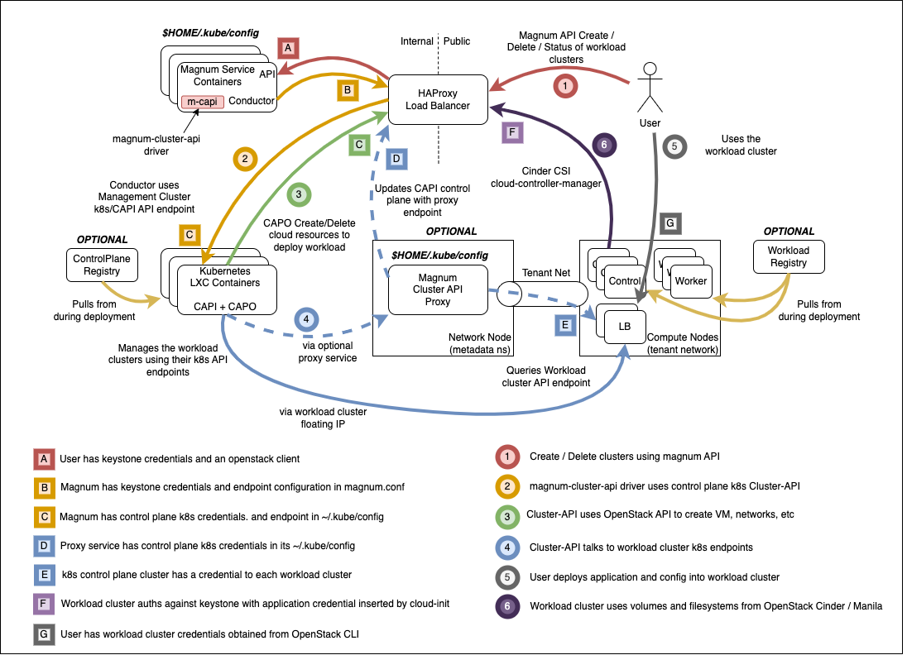

Install vexxhost magnum-cluster-api driver
##########################################

About this repository
---------------------

This repository includes playbooks and roles to deploy the Vexxhost
magnum-cluster-api driver for the OpenStack Magnum service.

The playbooks create a complete deployment including the control plane
k8s cluster which should result in a ready-to-go experience for operators.

The following architectural features are present:

* The control plane k8s cluster is an integral part of the openstack-ansible
  deployment, and forms part of the foundational components alongside mariadb
  and rabbitmq.
* The control plane k8s cluster is deployed on the infra hosts and integrated
  with the haproxy loadbalancer and OpenStack internal API endpoint, and not
  exposed outside of the deployment
* SSL is supported between all components and configuration is
  possible to support different certificate authorities on the internal
  and external loadbalancer endpoints.
* Control plane traffic can stay entirely within the management network
  if required
* The magnum-cluster-api-proxy service is deployed to allow communication
  between the control plane and workload clusters when a floating IP is not
  attached to the workload cluster.

* It is possible to do a completely offline install for airgapped environments

The magnum-cluster-api driver for magnum can be found here https://github.com/vexxhost/magnum-cluster-api

Documentation for the Vexxhost magnum-cluster-api driver is here https://vexxhost.github.io/magnum-cluster-api/

The ansible collection used to deploy the controlplane k8s cluster is here https://github.com/vexxhost/ansible-collection-kubernetes

The ansible collection used to deploy the container runtime for the controlplane k8s cluster is here https://github.com/vexxhost/ansible-collection-containers

**These playbooks require Openstack-Ansible Antelope or later.**

Highlevel overview of the Magnum infrastructure these playbooks will
build and operate against.

Pre-requisites
--------------

* An existing openstack-ansible deployment
* Control plane using LXC containers, bare metal deployment is not tested
* Core openstack services plus Octavia

OpenStack-Ansible Integration
-----------------------------

The playbooks are distributed as an ansible collection, and integrate with
Openstack-Ansible by adding the collection to the deployment host by
adding the following to  `/etc/openstack_deploy/user-collection-requirements.yml`
under the collections key.

  .. code-block:: yaml

     collections:
        - name: vexxhost.kubernetes
          source: https://github.com/vexxhost/ansible-collection-kubernetes
          type: git
          version: main
        - name: osa_ops.mcapi_vexxhost
          type: git
          version: master
          source: https://opendev.org/openstack/openstack-ansible-ops#/mcapi_vexxhost

The collections can then be installed with the following command:

  .. code-block:: bash

      cd /opt/openstack-ansible
      openstack-ansible scripts/get-ansible-collection-requirements.yml
 
OpenStack-Ansible configuration for magnum-cluster-api driver
^^^^^^^^^^^^^^^^^^^^^^^^^^^^^^^^^^^^^^^^^^^^^^^^^^^^^^^^^^^^^

Specify the deployment of the control plane k8s cluster in
`/etc/openstack_deploy/env.d/k8s.yml`

  .. code-block:: yaml

    ---
    component_skel:
      k8s_capi:
        belongs_to:
          - k8s_all

    container_skel:
      k8s_container:
        belongs_to:
          - cluster-api_containers
        contains:
          - k8s_capi

    physical_skel:
      cluster-api_containers:
        belongs_to:
          - all_containers
      cluster-api_hosts:
        belongs_to:
          - hosts

Define the physical hosts that will host the controlplane k8s
cluster, this example is for an all-in-one deployment and should
be adjusted to match a real deployment with multiple hosts if
high availability is required.

  .. code-block:: yaml

    cluster-api_hosts:
      aio1:
        ip: 172.29.236.100

Integrate the control plane k8s cluster with the haproxy loadbalancer
in `/etc/openstack-deploy/group_vars/k8s_all/haproxy_service.yml`

  .. code-block:: yaml

      ---
      haproxy_k8s_service:
        haproxy_service_name: k8s
        haproxy_backend_nodes: "{{ groups['k8s_all'] | default([]) }}"
        haproxy_ssl: false
        haproxy_ssl_all_vips: false
        haproxy_port: 6443
        haproxy_balance_type: tcp
        haproxy_balance_alg: leastconn
        haproxy_interval: '15000'
        haproxy_backend_port: 16443
        haproxy_backend_rise: 2
        haproxy_backend_fall: 2
        haproxy_timeout_server: '15m'
        haproxy_timeout_client: '5m'
        haproxy_backend_options:
          - tcplog
          - ssl-hello-chk
          - log-health-checks
          - httpchk GET /healthz
        haproxy_backend_httpcheck_options:
          - 'expect status 200'
        haproxy_backend_server_options:
          - check-ssl
          - verify none
        haproxy_accept_both_protocols: "{{ k8s_accept_both_protocols | default(openstack_service_accept_both_protocols) }}"
        haproxy_service_enabled: "{{ groups['k8s_all'] is defined and groups['k8s_all'] | length > 0 }}"

      k8s_haproxy_services:
        - "{{ haproxy_k8s_service | combine(haproxy_k8s_service_overrides | default({})) }}"

Configure the LXC container that will host the control plane k8s cluster to
be suitable for running nested containers in `/etc/openstack-deploy/group_vars/k8s_all/main.yml`

  .. code-block:: yaml

      ---
      lxc_container_config_list:
        - "lxc.apparmor.profile=unconfined"

      lxc_container_mount_auto:
        - "proc:rw"
        - "sys:rw"

Set up config-overrides for the magnum service in `/etc/openstack-deploy/user_variables_magnum.yml`.
Adjust the images and flavors here as necessary, these are just for demonstration. Upload as many
images as you need for the different workload cluster kubernetes versions.

  .. code-block:: yaml

      #list the images to upload to glance here, or set to an empty list
      #to handle image uploading by some other means
      magnum_glance_images:
        - disk_format: qcow2
          distro: ubuntu
          file: https://object-storage.public.mtl1.vexxhost.net/swift/v1/a91f106f55e64246babde7402c21b87a/magnum-capi/ubuntu-2204-kube-v1.23.17.qcow2
          image_format: bare
          name: ubuntu-2204-kube-v1.23.17
          public: true

      #the cluster templates cannot be created during the magnum installation
      #as the control plane k8s credentials must be in place first
      magnum_cluster_templates: []

      #any flavors specified in the cluster template must already exist
      #the magnum playbook can create flavors, or set to an empty list
      #to handle flavor creation by some other means
      magnum_flavors:
        - cloud: default
          disk: 40
          name: m1.medium
          ram: 4096
          vcpus: 2

  Set up config-overrides for the control plane k8s cluster in /etc/openstack-deploy/user_variables_k8s.yml`
  Attention must be given to the SSL configuration. Users and workload clusters will
  interact with the external endpoint and must trust the SSL certificate. The magnum
  service and cluster-api can be configured to interact with either the external or
  internal endpoint and must trust the SSL certificiate. Depending on the environment,
  these may be derived from different certificate authorities.

  .. code-block:: yaml

      # connect ansible group, host and network addresses into control plane k8s deployment
      kubernetes_control_plane_group: k8s_all
      kubelet_hostname: "{{ ansible_facts['hostname'] }}"
      kubelet_node_ip: "{{ management_address }}"
      kubernetes_hostname: "{{ internal_lb_vip_address }}"
      kubernetes_non_init_namespace: true

      # install the vexxhost magnum-cluster-api plugin into the magnum venv
      magnum_user_pip_packages:
        - git+https://github.com/vexxhost/magnum-cluster-api@main#egg=magnum-cluster-api

      # make the required settings in magnum.conf
      magnum_config_overrides:
        drivers:
          # ensure that the external VIP CA is trusted by the workload cluster
          openstack_ca_file: '/usr/local/share/ca-certificates/ExampleCorpRoot.crt'
        capi_client:
          # ensure that the internal VIP CA is trusted by the CAPI driver
          ca_file: '/usr/local/share/ca-certificates/ExampleCorpRoot.crt'
          endpoint: 'internalURL'
        cluster_template:
          # the only permitted workload network driver is calico
          kubernetes_allowed_network_drivers: 'calico'
          kubernetes_default_network_driver: 'calico'
        certificates:
          # store certificates in the magnum database instead of barbican
          cert_manager_type: x509keypair

      # Pick a range of addresses for the control plane k8s cluster cilium
      # network that do not collide with anything else in the deployment
      cilium_ipv4_cidr: 172.29.200.0/22

      # Set this manually, or kube-proxy will try to do this - not possible
      # in a non-init namespace and will fail in LXC
      openstack_host_nf_conntrack_max: 1572864

      # OSA containers do not run ssh so cannot use the ansible synchronize module
      upload_helm_chart_method: copy

Run the deployment
------------------

For a new deployment
^^^^^^^^^^^^^^^^^^^^

Run the OSA playbooks/setup.yml playbooks as usual, following the normal
deployment guide.

Run the magnum-cluster-api deployment

  .. code-block:: bash

     openstack-ansible osa_ops.mcapi_vexxhost.k8s_install

For an existing deployment
^^^^^^^^^^^^^^^^^^^^^^^^^^

Create the k8s control plane containers

openstack-ansible playbooks/lxc-containers-create.yml --limit k8s_all

Run the magnum-cluster-api deployment

.. code-block:: bash

   openstack-ansible osa_ops.mcapi_vexxhost.k8s_install

Use Magnum to create a workload cluster
---------------------------------------

Magnum cluster-api should now be ready to use

Upload Images

Create a cluster template

Optional Components
-------------------

Deploy the workload clusters with a local registry
^^^^^^^^^^^^^^^^^^^^^^^^^^^^^^^^^^^^^^^^^^^^^^^^^^

TODO - describe how to do this

Deploy the control plane cluster from a local registry
^^^^^^^^^^^^^^^^^^^^^^^^^^^^^^^^^^^^^^^^^^^^^^^^^^^^^^

TODO - describe how to do this

Use of magnum-cluster-api-proxy
^^^^^^^^^^^^^^^^^^^^^^^^^^^^^^^

TODO - describe what this is for

Troubleshooting
---------------

Local testing
-------------

An OpenStack-Ansible all-in-one configured with Magnum and Octavia is
capable of running a functioning magnum-cluster-api deployment.

Sufficient memory should be available beyond the minimum 8G usually required
for an all-in-one. A multinode workload cluster may require nova to boot several
Ubuntu images in addition to an Octavia loadbalancer instance. 64G would
be an appropriate amount of system RAM.

There also must be sufficient disk space in `/var/lib/nova/instances` to
support the required number of instances - the normal minimum of 60G
required for an all-in-one deployment will be insufficient, 500G would
be plenty.

