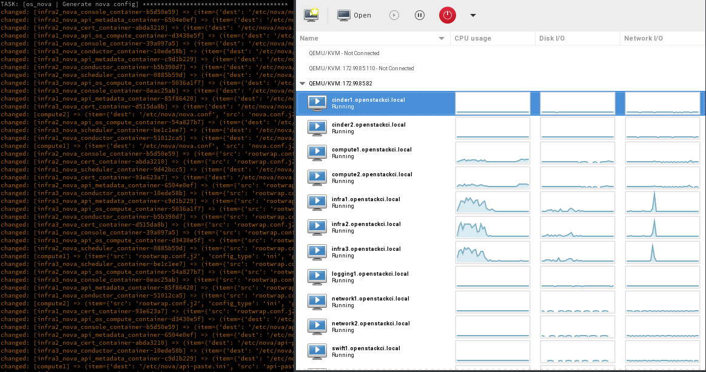
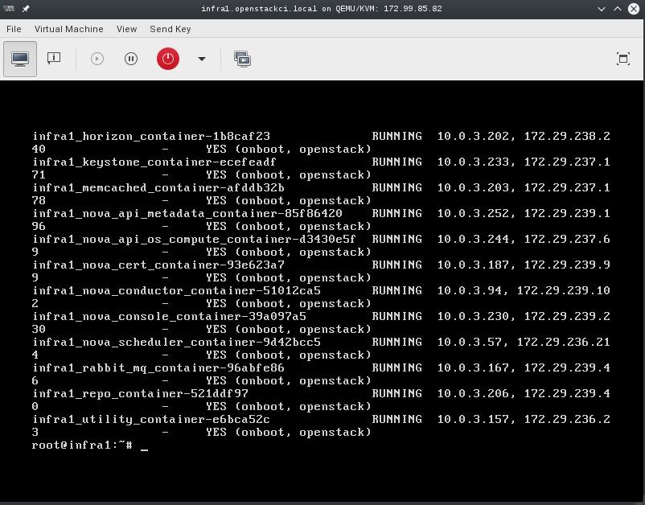

OpenStack-Ansible Multi-Node AIO
################################
:date: 2016-03-09
:tags: rackspace, openstack, ansible
:category: \*openstack, \*nix

About this repository
---------------------

Full OpenStack deployment using a single OnMetal host from the
Rackspace Public Cloud. This is a multi-node installation using
VMs that have been PXE booted which was done to provide an environment
that is almost exactly what is in production. This script will build, kick
and deploy OpenStack using KVM, Cobbler, OpenStack-Ansible within 13 Nodes
and 1 load balancer all using a Hyper Converged environment.

Process
-------

Create at least one physical host that has public network access and is running the
Ubuntu 14.04 LTS (Trusty Tahr) Operating system. This script assumes that you have
an unpartitioned device with at least 1TB of storage. If you're using the Rackspace
OnMetal servers the drive partitioning will be done for you by detecting the largest
unpartitioned device. If you're doing the deployment on something other than a Rackspace
OnMetal server you may need to modify the ``setup-host.sh`` script to do the needful in
your environment. If you know the device name you want to format you can also set the
``${DATA_DISK_DEVICE}`` variable accordingly.

Physical disk partitioning can be skipped by setting ``PARTITION_HOST=false``. If you set
this, make sure you have enough space available to run all of the infrastructure VMs within
``/var/lib/libvirt/images``.

===========    ========   ============
Physical Host Specs known to work well
--------------------------------------
 CPU CORES      MEMORY     DISK SPACE
===========    ========   ============
    20           124GB       1.3TB
===========    ========   ============

These specs are covered by the Rackspace OnMetal-IO v1/2 Servers.

When your ready, run the build script by executing ``bash ./build.sh``. The build script
current executes a deployment of OpenStack Ansible using the master branch. If you want to
do something other than deploy master you can set the ``${OSA_BRANCH}`` variable to any
branch, tag, or SHA.

Post Deployment
---------------

Once deployed you can use virt-manager to manage the KVM instances on the host, similar to a DRAC or ILO.

LINUX:
    If you're running a linux system as your workstation simply install virt-manager
    from your package manager and connect to the host via QEMU/KVM:SSH

OSX:
    If you're running a MAC you can get virt-manager via X11 forwarding to the host
    or install it via BREW. http://stackoverflow.com/questions/3921814/is-there-a-virt-manager-alternative-for-mac-os-x

WINDOWS:
    If you're running Windows, you can install virt-viewer from the KVM Download site.
    https://virt-manager.org/download/

Deployment screenshot
^^^^^^^^^^^^^^^^^^^^^

Deployments can be accessed and monitored via virt-manager

Console Access
^^^^^^^^^^^^^^

The root password for all VMs is "**cobbler**". This password is being set within the pre-seed files under the
"Users and Password" section. If you want to change this password please edit the pre-seed files.

Notes
-----

The cobbler and pre-seed setup has been implemented using some of the awesome work originally created by James Thorne.
  * cobbler installation post - https://thornelabs.net/2015/11/26/install-and-configure-cobbler-on-ubuntu-1404.html
  * pre-seeds -- https://github.com/jameswthorne/preseeds

Options
-------

Set the default preseed device name. This is being set because sda is on hosts, vda is kvm, xvda is xen:
  ``DEVICE_NAME="${DEVICE_NAME:-vda}"``

Set to instruct the preseed what the default network is expected to be:
  ``DEFAULT_NETWORK="${DEFAULT_NETWORK:-eth0}"``

Set the data disk device, if unset the largest unpartitioned device will be used to for host VMs:
  ``DATA_DISK_DEVICE="${DATA_DISK_DEVICE:-$(lsblk -brndo NAME,TYPE,FSTYPE,RO,SIZE | awk '/d[b-z]+ disk +0/{ if ($4>m){m=$4; d=$1}}; END{print d}')}"``

Set the VM disk size in gigabytes:
  ``VM_DISK_SIZE="${VM_DISK_SIZE:-252}"``

Set the OSA branch for this script to deploy:
  ``OSA_BRANCH=${OSA_BRANCH:-master}``

Enable partitioning of the "${DATA_DISK_DEVICE}":
  ``PARTITION_HOST=${PARTITION_HOST:-true}``

Instruct the system to deploy OpenStack Ansible:
  ``DEPLOY_OSA=${DEPLOY_OSA:-true}``

Instruct the system to Kick all of the VMs:
  ``DEPLOY_VMS=${DEPLOY_VMS:-true}``

Instruct the system to run VM disk image create:
  ``VM_IMAGE_CREATE=${VM_IMAGE_CREATE:-true}``

Instruct the system do all of the require host setup:
  ``SETUP_HOST=${SETUP_HOST:-true}``

Instruct the system do all of the cobbler setup:
  ``SETUP_COBBLER=${SETUP_COBBLER:-true}``

Instruct the system do all of the virsh network setup:
  ``SETUP_VIRSH_NET=${SETUP_VIRSH_NET:-true}``

Instruct the system to pre-config the envs for running OSA playbooks:
  ``PRE_CONFIG_OSA=${PRE_CONFIG_OSA:-true}``

Instruct the system to run the OSA playbooks, if you want to deploy other OSA powered cloud, you can set it to false:
  ``RUN_OSA=${RUN_OSA:-true}``

Re-kicking the VMs
------------------

The build process will add a function to the system to provide you a quick means to re-kick a VM host. The function added
is ``rekick_vms``. This function can be used to re-kick a specific host. To use this function use the short hostname along
with the function. EXAMPLE: ``rekick_vms infra1``. This command will destroy the root disk for the VM and reboot it causing
it to be re-PXE booted. Once the re-deployment has completed (<=10 min) the node will have a vanilla OS.

If you want to re-kick all known hosts you can execute the ``deploy-vms.sh`` script which will do everything needed to
boot all new VMs paving over the existing ones.

Adding nodes to the deployment
------------------------------

To add nodes to the deployment simply add the node entries to the hosts.json file. The file divides nodes by type and you
can add more nodes to any of the available types without any modifications made to the templates or build script. The first
100 IP address of all used CIDRs have been reserved in the ``openstack_user_config.yml`` and can be used when adding
additional hosts to the environment.

Rerunning the build script
--------------------------

The build script can be rerun at any time. If you have a successful run before and simply want to re-kick everything I
recommend nuking the running VMs and then executing the build script instructing it to NOT partition the host. This can
be easily done using the following snippet.

.. code-block:: bash

    for i in $(virsh list --all --name); do virsh destroy $i; virsh undefine $i; rm /var/lib/libvirt/images/$i.img; done
    rm ~/.ssh/known_hosts; PARTITION_HOST=false ./build.sh

Deploying OpenStack into the environment
----------------------------------------

While the build script will deploy OpenStack, you can choose to run this manually. To run a basic deploy using a given branch you can use the following snippet.

.. code-block:: bash

    OSA_BRANCH=master ./deploy-osa.sh

Snapshotting an environment before major testing
------------------------------------------------

Running a snapshot on all of the vms before doing major testing is wise as it'll give you a restore point without having to re-kick
the cloud. You can do this using some basic ``virsh`` commands and a little bash.

.. code-block:: bash

    for instance in $(virsh list --all --name); do
      virsh snapshot-create-as --atomic --name $instance-kilo-snap --description "saved kilo state before liberty upgrade" $instance
    done

Once the previous command is complete you'll have a collection of snapshots within all of your infrastructure hosts. These snapshots
can be used to restore state to a previous point if needed. To restore the infrastructure hosts to a previous point,
using your snapshots, you can execute a simple ``virsh`` command or the following bash loop to restore everything to a known point.

.. code-block:: bash

    for instance in $(virsh list --all --name); do
      virsh snapshot-revert --snapshotname $instance-kilo-snap --running $instance
    done
