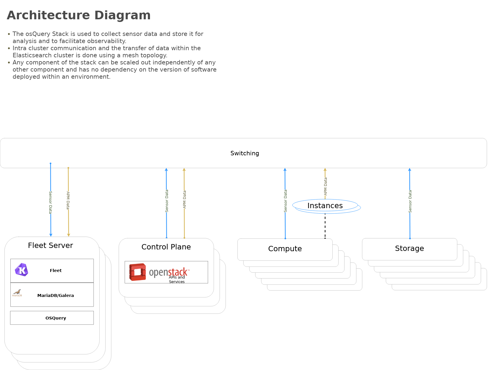

Install OSQuery and Kolide fleet
################################
:tags: openstack, ansible

About this repository
---------------------

This set of playbooks will deploy osquery and kolide-fleet. If this is being
deployed as part of an OpenStack all of the inventory needs will be provided for.

**These playbooks require Ansible 2.4+.**

Highlevel overview of Osquery & Kolide Fleet  infrastructure these playbooks will
build and operate against.

.. image:: assets/overview-osquery.png
    :scale: 50 %
    :alt: Osquery & Kolide Fleet Architecture Diagram
    :align: center

OpenStack-Ansible Integration
-----------------------------

These playbooks can be used as standalone inventory or as an integrated part of
an OpenStack-Ansible deployment. For a simple example of standalone inventory
see ``inventory.example.yml``.

Setup | system configuration
^^^^^^^^^^^^^^^^^^^^^^^^^^^^

Clone the osquery-osa repo

.. code-block:: bash

    cd /opt
    git clone https://github.com/openstack/openstack-ansible-ops

Copy the env.d file into place

.. code-block:: bash

    cd /opt/openstack-ansible-ops/osquery
    cp env.d/fleet.yml /etc/openstack_deploy/env.d/

Copy the conf.d file into place

.. code-block:: bash

    cp conf.d/fleet.yml /etc/openstack_deploy/conf.d/

In **fleet.yml**, list your logging hosts under fleet-logstash_hosts to create
the kolide fleet cluster in multiple containers and one logging host under
`fleet_hosts` to create the fleet container

.. code-block:: bash

    vi /etc/openstack_deploy/conf.d/fleet.yml

Create the containers

.. code-block:: bash

   cd /opt/openstack-ansible/playbooks
   openstack-ansible lxc-containers-create.yml --limit fleet_all

Update the `/etc/hosts` file *(optional)*

.. code-block:: bash

   cd /opt/openstack-ansible/playbooks
   openstack-ansible openstack-hosts-setup.yml

Create an haproxy entry for kolide-fleet service 8443

Add the following configuration item to the `haproxy_extra_services` variable
within a **user** defined variable file.

.. code-block:: yaml

    haproxy_extra_services:
      - service:
          haproxy_service_name: kolide-fleet
          haproxy_ssl: False
          haproxy_backend_nodes: "{{ groups['kolide-fleet_all'] | default([]) }}"
          haproxy_port: 6443  # This is set using the "kolide_fleet_port" variable
          haproxy_check_port: 443  # This is set using the "kolide_fleet_port" variable
          haproxy_backend_port: 443  # This is set using the "kolide_fleet_port" variable
          haproxy_balance_type: tcp

With the appropriate haproxy configuration in place, setup haproxy to begin
load balancing the traffic.

.. code-block:: bash

    cd /opt/openstack-ansible/playbooks/
    openstack-ansible haproxy-install.yml

Deploying | Installing with embedded Ansible
^^^^^^^^^^^^^^^^^^^^^^^^^^^^^^^^^^^^^^^^^^^^

If this is being executed on a system that already has Ansible installed but is
incompatible with these playbooks the script `bootstrap-embedded-ansible.sh` can
be sourced to grab an embedded version of Ansible prior to executing the
playbooks.

.. code-block:: bash

    source bootstrap-embedded-ansible.sh

Deploying | Manually resolving the dependencies
^^^^^^^^^^^^^^^^^^^^^^^^^^^^^^^^^^^^^^^^^^^^^^^

This playbook has external role dependencies. If Ansible is not installed with
the `bootstrap-ansible.sh` script these dependencies can be resolved with the
``ansible-galaxy`` command and the ``ansible-role-requirements.yml`` file.

* Example galaxy execution

.. code-block:: bash

    ansible-galaxy install -r ansible-role-requirements.yml --roles-path=~/ansible_venv/repositories/roles

In the even that some of the modules are alread installed execute the following

.. code-block:: bash

    ansible-galaxy install -r ansible-role-requirements.yml --ignore-errors --roles-path=~/ansible_venv/repositories/roles

Once the dependencies are set make sure to set the action plugin path to the
location of the config_template action directory. This can be done using the
environment variable `ANSIBLE_ACTION_PLUGINS` or through the use of an
`ansible.cfg` file.

Deploying | The environment
^^^^^^^^^^^^^^^^^^^^^^^^^^^

Create some basic passwords keys that are needed by fleet

.. code-block:: bash

    echo "kolide_fleet_db_password: $(openssl rand -base64 16)" >> /etc/openstack_deploy/user_secrets.yml
    echo "kolide_fleet_jwt_key: $(openssl rand -base64 32)" >> /etc/openstack_deploy/user_secrets.yml
    echo "kolide_fleet_admin_password: $(openssl rand -base64 16)" >> /etc/openstack_deploy/user_secrets.yml
    # NOTICE: This may already be defined
    echo "kolide_galera_root_password: $(openssl rand -base64 16)" >> /etc/openstack_deploy/user_secrets.yml

Install master/data Fleet nodes on the elastic-logstash containers,
deploy logstash, deploy Kibana, and then deploy all of the service beats.

.. code-block:: bash

    cd /opt/openstack-ansible-ops/osquery
    ansible-playbook site.yml -e@/etc/openstack_deploy/user_secrets.yml

If the `installOSquery.yml` playbook is executed with a limit, a single
kolide-fleet host must be part of the limit. This requirement exists because
the nodes running osquery require certificates to authenticate to the
kolide-fleet cluster. Should a node within the kolide-fleet cluster not be
part of the limit the playbooks will not be able to fetch the required
certificates.

.. code-block:: bash

    ansible-playbook installOSquery.yml $USER_VARS --limit 'host1,host2,kolide-fleet_all[0]'

* The `openstack-ansible` command can be used if the version of ansible on the
  system is greater than **2.5**. This will automatically pick up the necessary
  group_vars for hosts in an OSA deployment.

* If required add ``-e@/opt/openstack-ansible/inventory/group_vars/all/all.yml``
  to import sufficient OSA group variables to define the OpenStack release.

* Alternatively if using the embedded ansible, create a symlink to include all
  of the OSA group_vars. These are not available by default with the embedded
  ansible and can be symlinked into the ops repo.

.. code-block:: bash

    ln -s /opt/openstack-ansible/inventory/group_vars /opt/openstack-ansible-ops/osquery/group_vars

The individual playbooks found within this repository can be independently run
at anytime.

Local testing
-------------

To test these playbooks within a local environment you will need a single server
with at leasts 8GiB of RAM and 40GiB of storage on root. Running an `m1.medium`
(openstack) flavor size is generally enough to get an environment online.

To run the local functional tests execute the `run-tests.sh` script out of the
tests directory. This will create a single node kolide-fleet cluster and install
osquery on the local host.

.. code-block:: bash

    CLUSTERED=yes tests/run-tests.sh

To rerun the playbooks after a test build, source the `tests/manual-test.rc`
file and follow the onscreen instructions.

To clean-up a test environment and start from a bare server slate the
`run-cleanup.sh` script can be used. This script is disruptive and will purge
all `osquery` related services within the local test environment.

.. code-block:: bash

   tests/run-cleanup.sh

Architecture | Data flow
^^^^^^^^^^^^^^^^^^^^^^^^

This diagram outlines the data flow from within an osquery deployment.

